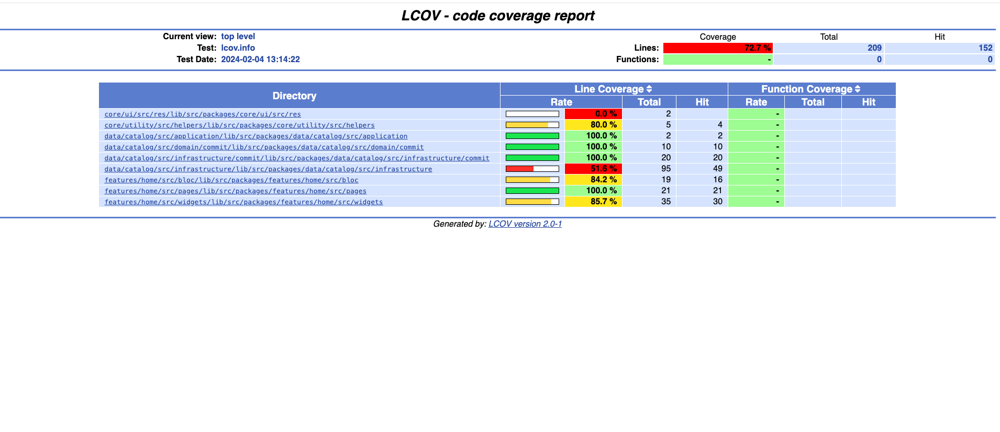

# GitHub Api

App that show git commit history. This app is built with Flutter.

For this poject Clean Architecture was choosen.  Beacause keep the code clean and tested are the two most important development practices. Even state management patterns like BLoC are not sufficient in themselves to allow for easily extendable codebase. If you want to learn more about this, you can read my article [here](https://medium.com/@alvaro.armijoss/improve-your-flutter-development-with-clean-architecture-and-tdd-4c13e6af4f18 "here").

For this we should all strive to separate code into independent layers and depend on abstractions instead of concrete implementations.

Every "Date module" of the app, like home, is divided into 3 layers - presentation, domain and infrastructure. This app  have only one data module, Catalog.

The presentation layer("Features") contain Pages, Widgets and Bloc. 

The data layer contain Entities, Repositories and Usecases. It should be totally independent of every other layer. The data layer consists of a Repository implementation and data sources - this is usually for getting remote (API) data.

<p>
     
     
</p>

# Starting 🚀

These instructions will allow you to obtain a copy of the application for testing.

## Getting Started
To build and run this project:

1. Get Flutter [here](https://flutter.dev) if you don't already have it
2. Clone this repository `git clone https://github.com/alvaroarmijos/ftf_github_api`
3. `cd` into the repo folder `cd ftf_github_api`
4. `flutter pub get`
5. Replace the **token** inside lib/src/packages/data/catalog/src/infrastructure/api_client.dart
6. run `flutter run` to run the app.


## Running the example code

This sample requires Flutter 3.16

## Running Tests

The test coverage of this application is 72%.

<p>
     
</p>

All you have to do is to run these three commands:

```
# Generate `coverage/lcov.info` file
flutter test --coverage
#Remove DI files from coverage
lcov --remove coverage/lcov.info "**/di/" -o coverage/lcov.info
# Generate HTML report
# Note: on macOS you need to have lcov installed on your system (`brew install lcov`) to use this:
genhtml coverage/lcov.info -o coverage/html
# Open the report
open coverage/html/index.html
```

## Requirements 📋
You need these packages for the application to work
- [get_it](https://pub.dev/packages/get_it "get_it")
- [flutter_bloc ](https://pub.dev/packages/flutter_bloc "flutter_bloc ")
- [equatable](https://pub.dev/packages/equatable "equatable")
- [http](https://pub.dev/packages/http#-installing-tab- "http")
- [mocktail ](https://pub.dev/packages/mocktail "mocktail ")
- [bloc_test ](https://pub.dev/packages/bloc_test "bloc_test ")
- [network_image_mock ](https://pub.dev/packages/network_image_mock "network_image_mock ")
- [intl ](https://pub.dev/packages/intl "intl ")


# Built with 🛠️
  - [Flutter](https://flutter.dev/ "flutter")
  - [GitHub API](https://docs.github.com/es/rest?apiVersion=2022-11-28 "GitHub API")